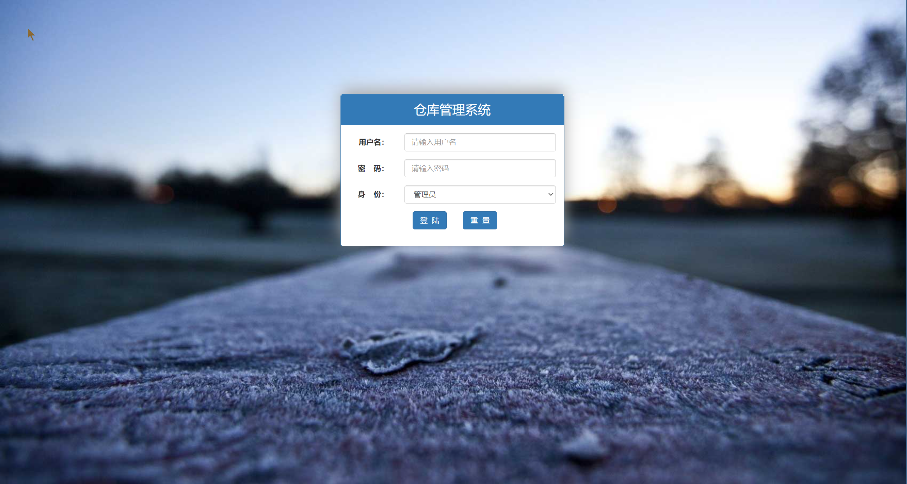
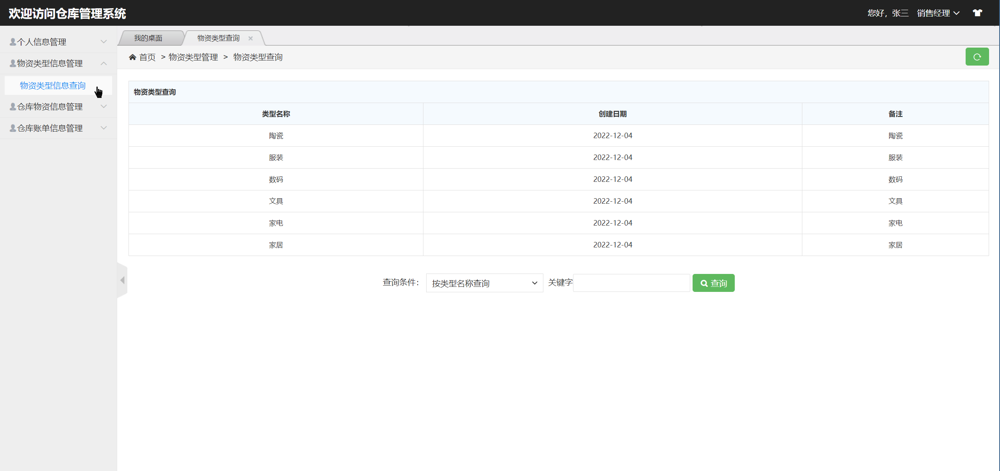
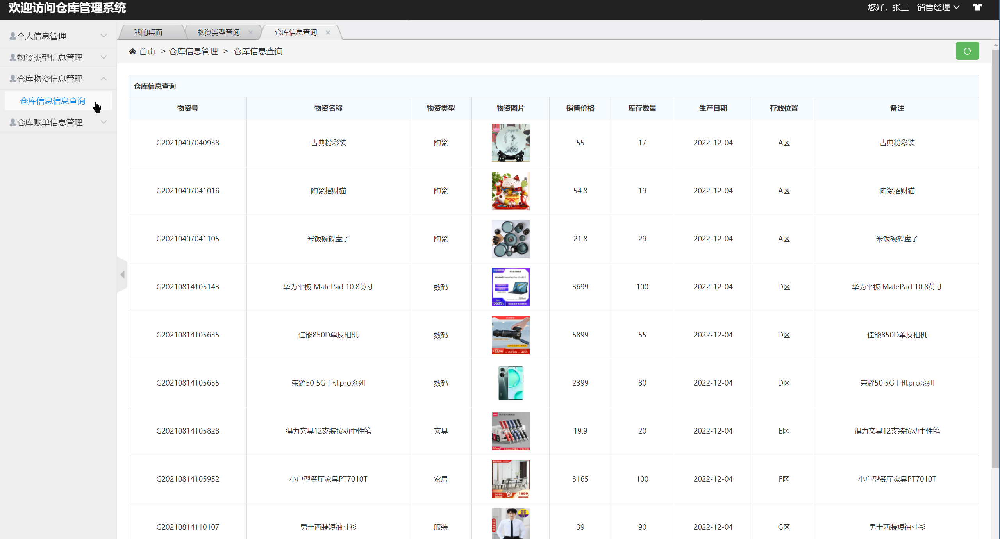
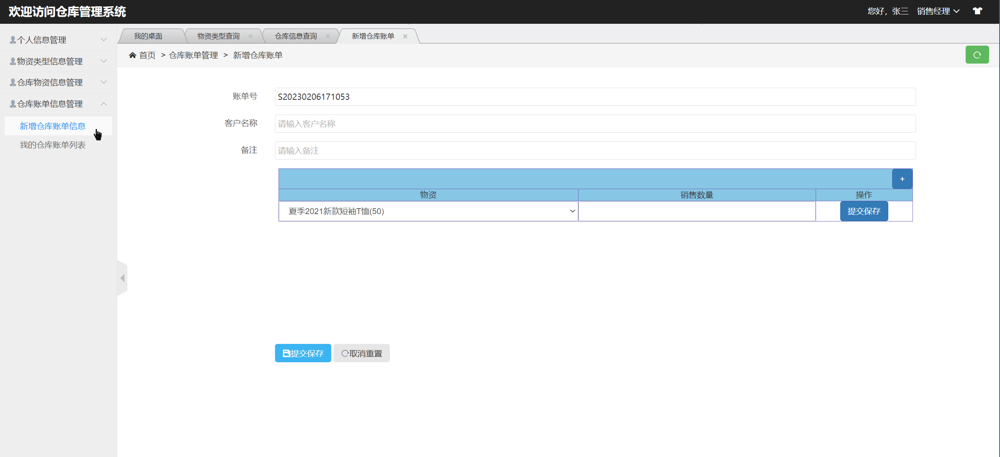
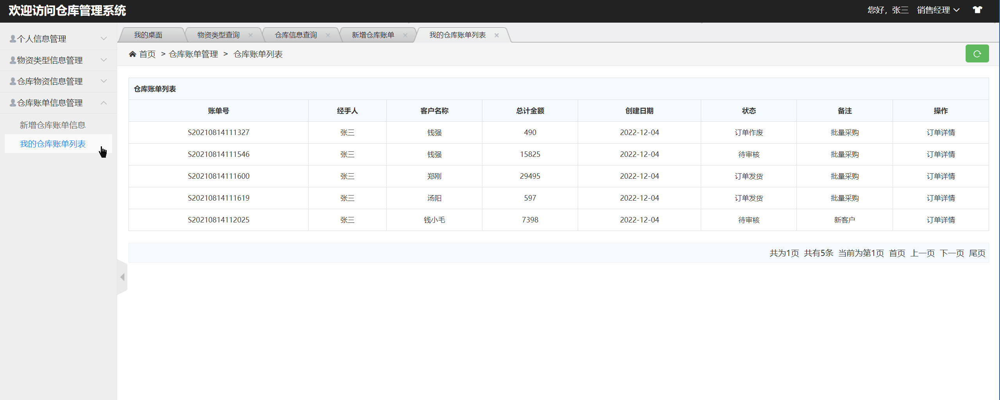
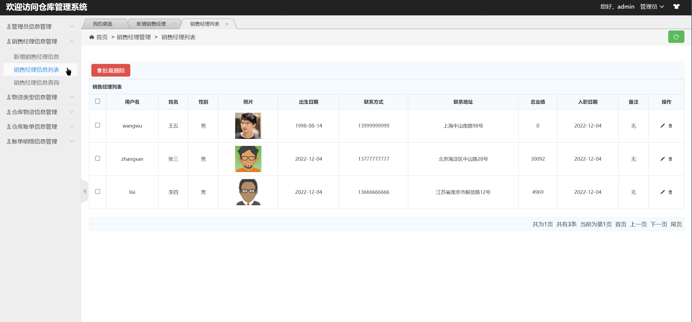
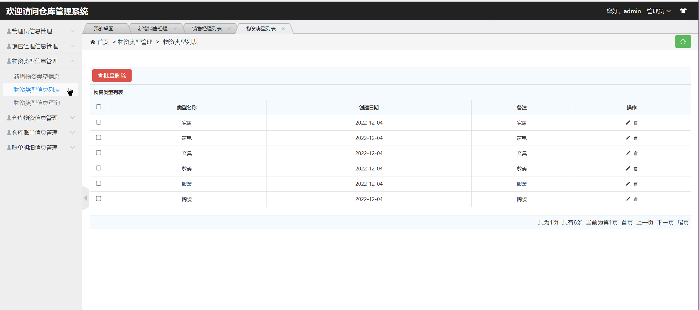

基于SSM的仓库管理系统
=
### 完整代码获取地址：从戎源码网 ([https://armycodes.com/](https://armycodes.com/))
### 作者微信：19941326836  QQ：952045282 
### 承接计算机毕业设计、Java毕业设计、Python毕业设计、深度学习、机器学习
### 选题+开题报告+任务书+程序定制+安装调试+论文+答辩ppt 一条龙服务
### 所有选题地址https://github.com/nature924/allProject

一、项目介绍
---
基于SSM实现的仓库管理系统，系统共包含两种角色，分别是：管理员、销售经理，其功能如下：
### 1.管理员
系统登陆、管理员信息管理、销售经理信息管理、物资类型信息管理、仓库物资信息管理、仓库账单信息管理、账单明细信息管理等功能。
### 2.销售经理
用户登陆、个人信息管理、修改密码、物资类型信息管理、仓库物资信息管理、仓库账单信息管理、新增仓库账单信息等功能。
该系统功能完善、界面美观、操作简单、功能齐全、管理便捷，具有很高的实际应用价值。

二、项目技术
---
- 编程语言：Java
- 数据库：MySQL
- 项目管理工具：Maven
- 前端技术：JSP、HTML、Jquery、Layui、ECharts
- 后端技术：Spring、SpringMVC、MyBatis

三、运行环境
---
- 操作系统：Windows、macOS都可以
- JDK版本：JDK1.8以上都可以
- 开发工具：IDEA、Ecplise、Myecplise都可以
- 数据库: MySQL5.7以上都可以
- Tomcat：任意版本都可以
- Maven：任意版本都可以

四、运行截图
---

### 程序截图：

